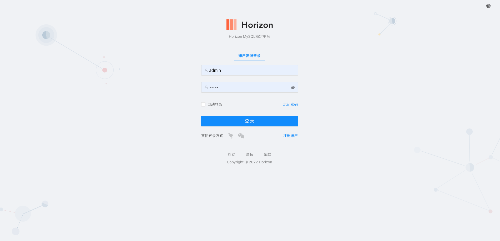
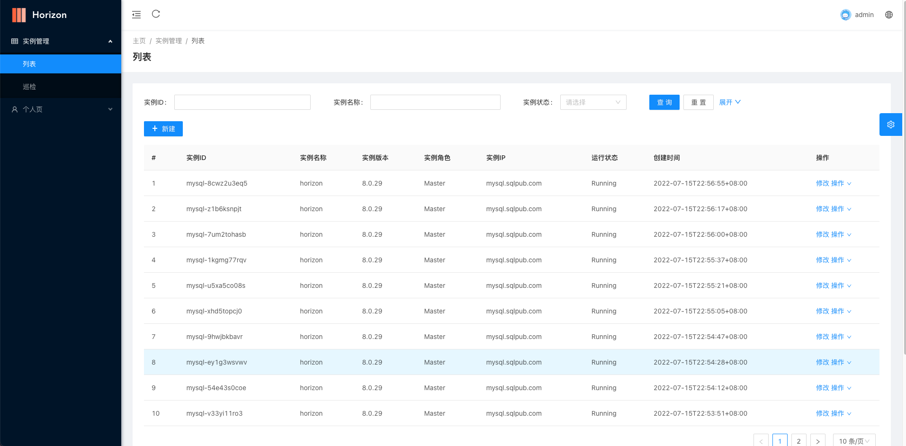
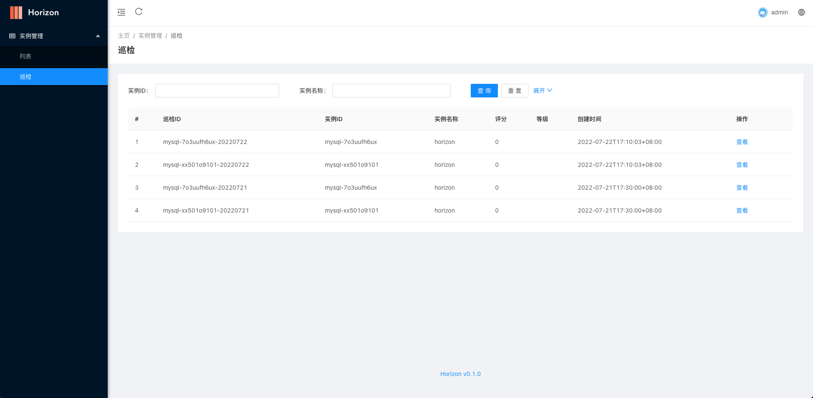

    

# Horizon MySQL稳定平台

### 在线体验

[horizon](http://sqlpub.com:8082/)

### Depend on 依赖项

[horizon-web](https://github.com/liuxinwang/horizon-web)

### Feature 功能
- 实例管理
    - 列表
    - 巡检
      - 列表查询
      - 定时任务采集
      - TODO 评分计算

### Install 安装及使用
- 下载最新的releases https://github.com/liuxinwang/horizon/releases
- 修改配置conf.toml
  - SecretKey 32为长度key
  - Environment = prod
  - Port web端口，默认8080
  - 配置Mysql相关信息
  - 配置Prometheus API地址
- 启动 ./horizon
- 初始化admin用户（参考脚本scripts/init.sql）
- 访问 127.0.0.1:8080

### About 联系方式

E-mail: sqlpub@foxmail.com

### Snapshot 效果展示

-   Login

-   Instance

-   Inspection

