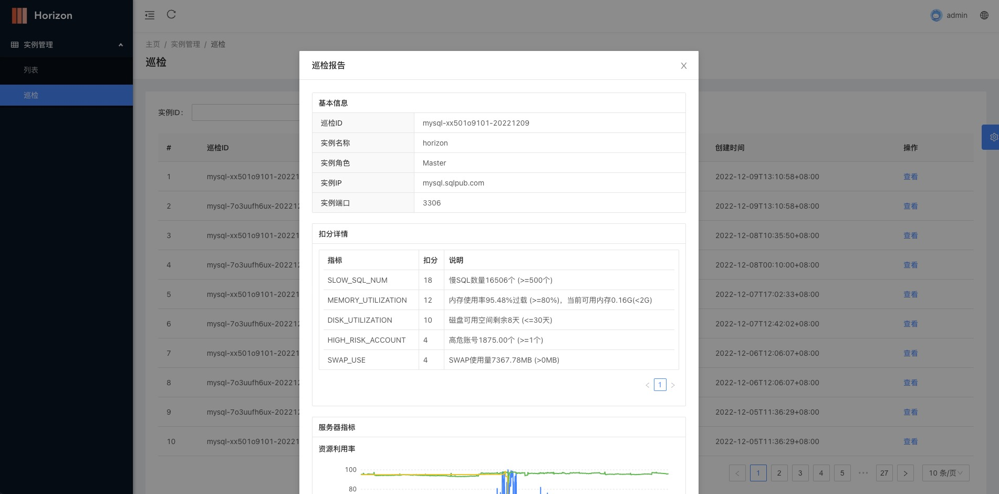
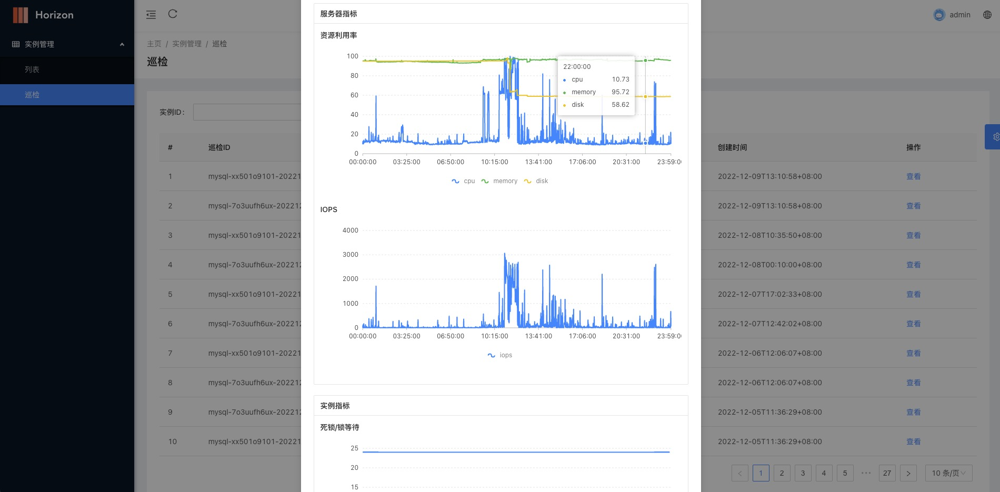

    

# Horizon MySQL稳定平台

### 在线体验

[horizon](http://sqlpub.com:8082/)

### Depend on 依赖项

[horizon-web](https://github.com/liuxinwang/horizon-web)

### Feature 功能
- 实例管理
    - 列表
- 巡检报告
  - 列表查询
  - 定时任务采集
  - 查看巡检报告
  - 评分计算
  - 评分等级
- TODO 诊断优化
  - 异常诊断
  - 实例会话
  - 慢查分析
  - 空间分析
  - 审计日志
- TODO SQL审核
  - SQL查询
  - SQL上线
  - 数据导出
  - 安全规则
  - 审批流程
  - 操作审计
- TODO 数据传输
- TODO 数据库备份
- 系统管理
  - 用户管理
  - 角色管理

### Install 安装及使用
- 下载最新的releases https://github.com/liuxinwang/horizon/releases
- 修改配置conf.toml
  - SecretKey 32为长度key
  - Environment = prod
  - Port web端口，默认8080
  - 配置Mysql相关信息
  - 配置Prometheus API地址
- 启动 ./horizon
- 初始化admin用户（参考脚本scripts/init.sql）
- 访问 127.0.0.1:8080

### About 联系方式

E-mail: sqlpub@foxmail.com

### Snapshot 效果展示

-   Login

-   Instance

-   Inspection

-   Inspection-detail

